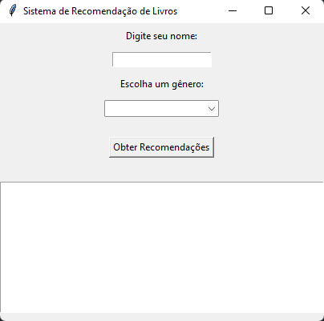

<div align="center">

</div>

# 📚 Book Recommendation

Bem-vindo ao sistema de recomendação de livros! Este projeto permite que você descubra novos livros com base nas suas preferências.

## 📜 Uso

Siga os passos abaixo para configurar e executar o sistema de recomendação:

1. **Instale o Python**: Certifique-se de que você tem o Python 3.12.4 instalado em seu computador. [Baixe o Python aqui](https://www.python.org/downloads/).

2. **Configure o Ambiente**:
    - Abra o Visual Studio Code.
    - Utilize o terminal integrado para instalar as bibliotecas necessárias executando os seguintes comandos:
        ```bash
        pip install pandas
        pip install tk
        ```

3. **Execute o Código**:
    - Abra o arquivo do projeto no Visual Studio Code.
    - Execute o script principal para iniciar o sistema de recomendação.

## 🖥️ Tecnologias Utilizadas

- **Python**: Linguagem de programação principal utilizada no projeto.
- **Pandas**: Biblioteca utilizada para manipulação e análise de dados.
- **Tk e Tkinter**: Bibliotecas utilizadas para criar a interface gráfica do usuário (GUI).

